# Workus Shield

### AI-Powered Predictive Income Protection for Gig Delivery Workers

**Hackathon:** Guidewire DEVTrails 2026

---

## 🔷 Product Identity

**Workus Shield is not just an insurance platform — it is a predictive income protection system for gig workers.**

It combines AI prediction, parametric insurance, and real-time verification to ensure workers are protected **before, during, and after disruptions.**

---

# 👥 Team

### Team Leader

* Aman Kesarwani

### Team Members

* Abhay Gupta
* Abhay Singh Rajawat
* Brahmdev Arya
* Anamika Maddeshiya

---

# 📌 Problem Statement

India’s gig delivery ecosystem (Zomato, Swiggy, Blinkit, Zepto, Amazon, etc.) forms a major part of the modern digital economy. Delivery partners depend on **daily work hours and completed deliveries** to earn income.

However, external disruptions such as:

* heavy rainfall
* floods
* extreme heatwaves
* severe pollution spikes
* curfews or strikes
* platform outages

can immediately reduce working hours and cause **direct income loss**.

Currently, gig workers bear this financial loss themselves because there is **no specialized income protection system designed for their work model.**

---

# 🎯 Solution Overview

**Workus Shield** is an AI-powered parametric insurance platform that protects gig workers from income loss.

Instead of traditional claim-based insurance, the system:

1. monitors environmental and operational data continuously
2. predicts disruptions before they happen
3. detects disruption events automatically
4. verifies affected workers using real-time data
5. triggers automated payouts instantly

👉 This ensures **fast, fair, and reliable income protection.**

---

# 👤 Target Persona

Gig delivery workers such as:

* Zomato delivery partners
* Swiggy delivery riders
* Blinkit / Zepto riders

### Characteristics:

* earn per delivery
* operate on weekly earning cycles
* work outdoors in unpredictable environments
* frequently affected by disruptions

---

# 🚀 Key Innovations

## 🤖 AI Predictive Risk Alerts

Workus Shield **predicts disruptions before they occur**.

The system analyzes:

* weather forecasts
* AQI trends
* historical disruption patterns
* environmental risk zones

### Example Alert:

Heavy Rain Expected
Location: Karol Bagh
Time: 45 minutes
Risk Level: High
Confidence: 82%

👉 Workers receive early warnings and can take preventive action.

---

## 🌍 Location-Aware Smart Triggers (Your Core Innovation)

Environmental conditions vary across cities.

Using fixed thresholds would create incorrect payouts.

Workus Shield introduces:

### **City-Specific Baseline Logic**

| City      | Normal AQI | Insurance Trigger |
| --------- | ---------- | ----------------- |
| Delhi     | 250        | >400              |
| Bangalore | 80         | >150              |

### Concept:

Trigger Level = City Baseline × Risk Multiplier

👉 Ensures payouts only during **abnormal conditions**, not normal city behavior.

---

## ⚖️ Rare Event Filtering

Insurance should trigger only during **rare disruptive events**.

| Situation         | Payout |
| ----------------- | ------ |
| Normal AQI        | No     |
| Extreme AQI spike | Yes    |
| Light rain        | No     |
| Flood rainfall    | Yes    |

👉 Keeps system **financially sustainable and fair**

---

## 📍 Zone-Based Claim Verification

Claims are validated using geolocation logic.

### Rule:

distance(worker_location, event_location) < event_radius
AND worker_status = active
AND policy_status = active

👉 Ensures only affected workers receive payouts.

---

## 🛡 Worker Activity Verification

Prevents fraud by checking:

* worker online status
* delivery activity
* GPS validation

👉 Ensures payouts go to **genuine workers only**

---

## 🔍 Transparent Claim Explanation (NEW – TRUST LAYER)

Workus Shield provides full transparency on claim approval.

### Example:

* Rainfall: 72 mm
* City Baseline: 30 mm
* Trigger Threshold: 60 mm
* Distance from Event: 200 m
* Event Radius: 500 m
* Worker Activity: Active

👉 Builds **trust and accountability** in automated payouts.

---

## 📊 AI Confidence & Risk Scoring

Each prediction includes:

* Risk Level: Low / Medium / High
* Confidence Score (e.g., 82%)

👉 Helps workers understand reliability of alerts.

---

# 💰 Weekly Insurance Model

Designed for gig economy income cycles.

| Plan     | Weekly Premium | Coverage                                  |
| -------- | -------------- | ----------------------------------------- |
| Basic    | ₹15/week       | Rain disruption                           |
| Standard | ₹25/week       | Rain + Heatwave                           |
| Premium  | ₹35/week       | Rain + Heat + Pollution + Platform outage |

👉 Premiums are automatically deducted weekly.

---

# ⚙️ Parametric Insurance Model

Payouts are triggered automatically when predefined conditions are met.

### Triggers:

* heavy rainfall
* extreme heatwaves
* pollution spikes
* platform outages
* local disruptions

👉 No manual claim process required.

---

# 🧠 AI-Powered Risk Assessment

AI models analyze:

* environmental trends
* historical data
* city-specific risks
* weather forecasts

### Output:

* disruption prediction
* risk scoring
* premium optimization

---

# 🏗 System Architecture

Worker Web App
↓
Backend API
↓
Database
↓
AI Risk Prediction Engine
↓
Event Detection Engine
↓
Geolocation Verification Engine
↓
Claim Automation Engine
↓
Wallet & Payout System

---

# 🔄 Example Workflow

1. Worker logs in
2. Worker activates insurance plan
3. AI predicts disruption risk
4. System detects disruption
5. Worker location + activity verified
6. Claim eligibility evaluated
7. Payout automatically credited

---

# 🔁 System Workflow (Prototype)

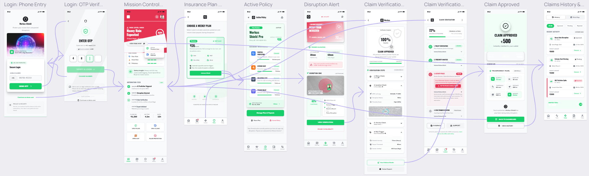

---

# 📱 Prototype Screens

*Designed using Visily AI (mobile-first UI)*

### Login

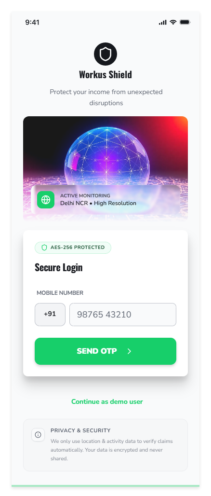

### OTP Verification

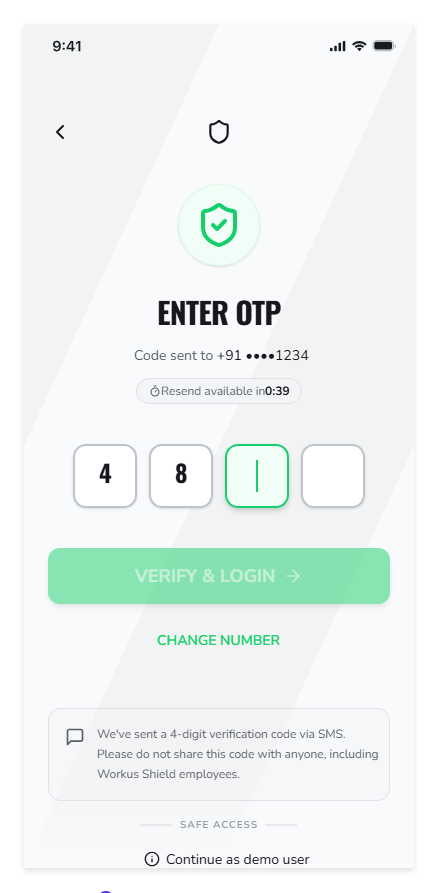

### Mission Control Dashboard

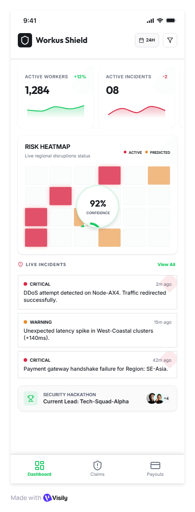

### Insurance Plans

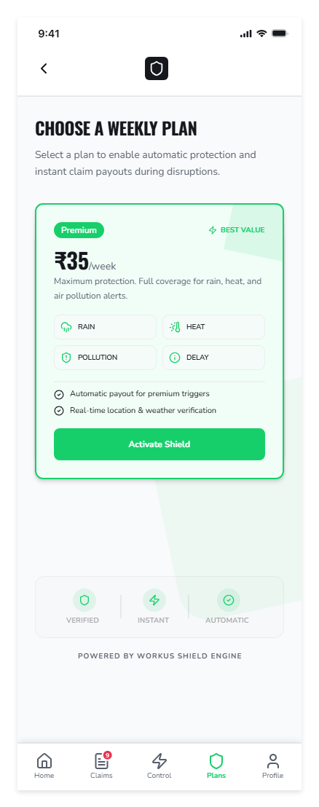

### Active Policy

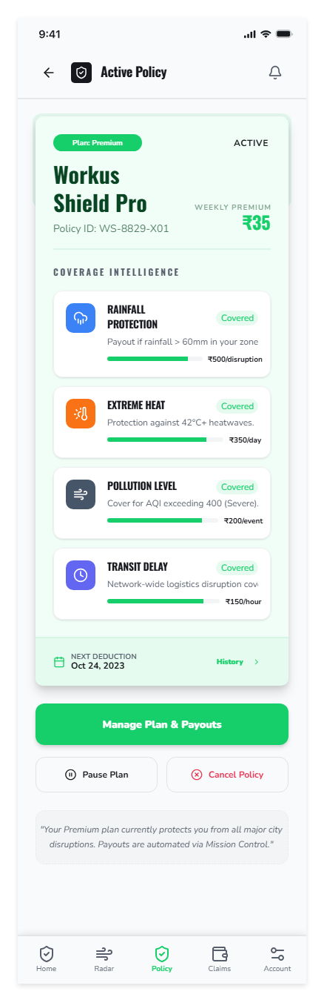

### Disruption Alert

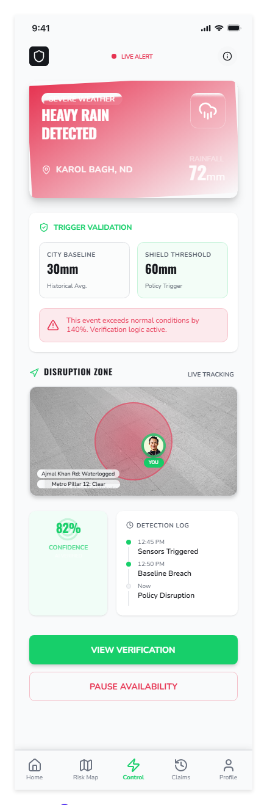

### Claim Verification (Approved)

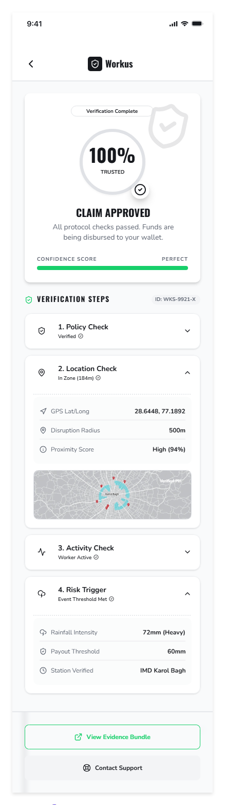

### Claim Verification (Pending)

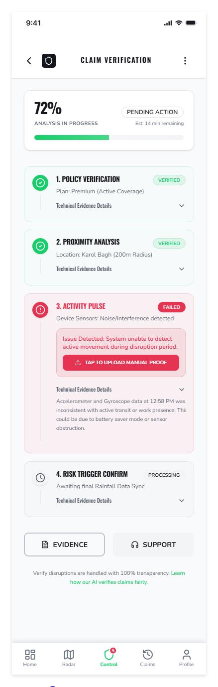

### Claim Approved

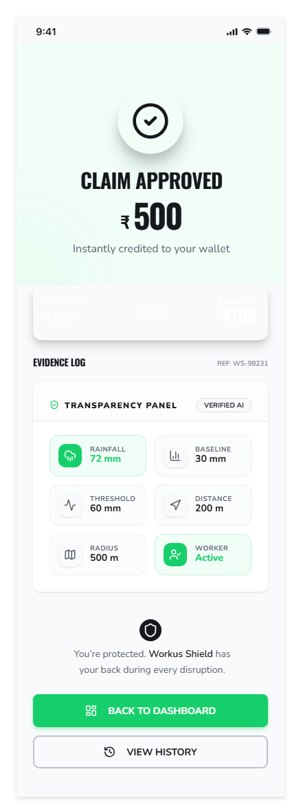

### Claim History & Map

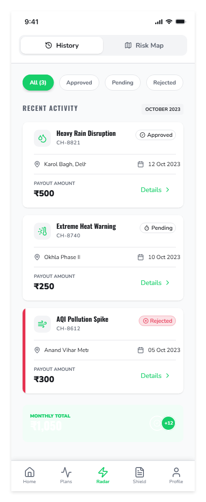

---

# 📱 Prototype Scope (Seed Phase)

The prototype demonstrates:

* Login (Phone + OTP)
* Mission Control Dashboard (AI alerts + risk insights)
* Insurance plan selection
* Disruption alert with baseline logic
* Claim verification (stepper UI)
* Claim approval with explanation
* Claim history
* Risk intelligence map

👉 Focus is on **product flow and UX**

---

# 🛠 Technology Stack

### Frontend

* React
* Tailwind CSS

### Backend

* FastAPI (Python)

### Database

* MySQL

### AI / ML

* Python models
* anomaly detection

### APIs

* Weather API
* AQI API
* traffic / disruption data

### Visualization

* Leaflet.js

---

# 🗺 Repository Structure

workus-shield/

* frontend/
* backend/
* prototype/
* docs/
* README.md

---

# 🏁 Conclusion

Workus Shield creates a financial safety net for gig workers by combining:

* AI predictive disruption alerts
* city-specific environmental baselines
* rare-event filtering
* zone-based verification
* worker activity validation
* transparent claim explanation
* automated parametric payouts

👉 It transforms insurance into a **predictive protection system**

---

## 💡 Final Vision

**From reactive insurance → to proactive income protection**
